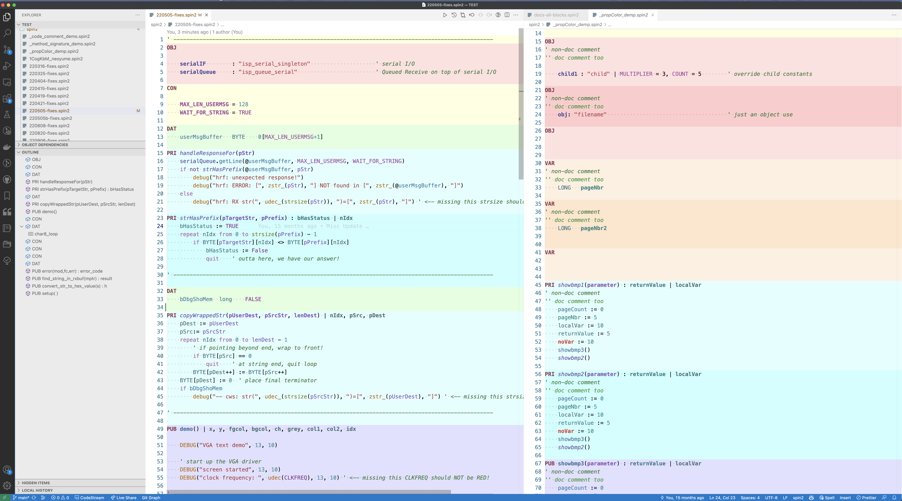
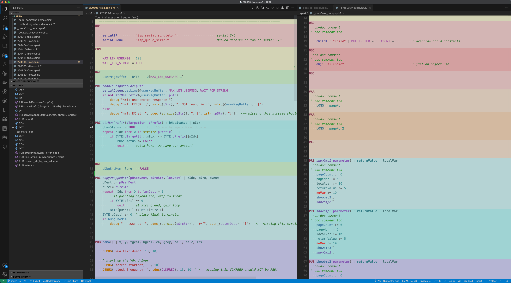

# Spin2/Pasm2 Editor Background Coloring for VSCode

This page presents how to easily set up your VSCode editor to color the spin/spin2 files as the Prallax "Propeller Tool" colors them.

![Project Maintenance][maintenance-shield]

[![License][license-shield]](LICENSE)

## Enable screen colors à la `Parallax Propeller Tool`

The Spin2 vscode extension now supports spin/spin2 Code Block background coloring. 

Setting up this feature is pretty easy. You will need to:

1. Enable "color editor backgrounds" in the spin2 extension settings, and
1. Select a Light or Dark theme for use with the colored backgrounds.  That's it!

### Light Mode

### Dark Mode

#### Enable in Settings 

Press Cmd+Comma then enter `spin2` to filter the settings list to just our Spin2 extension settings.  Look for "Spin Extension Behavior: **Color Editor Background**" and toggle the "Enable..." setting (make sure it is checked).

When it is set as desired, close the "Settings" Tab.

#### Select a Light or Dark theme

To select a supporting color theme press (Cmd+K, Cmd+T) Then locate either the `Spin2 Ironsheep Light for background color` or scroll down further to the `Spin2 Ironsheep Dark for background color` theme.  These set  your editor overall appearance to Light or Dark appearance and also selects semantic highlight colors with more contrast for use on light backgrounds.

### NOTEs: Brace, Bracket, and Parenthesis coloring

While I was working on developing this feature I noticed this pair coloring does not work too well with lightly colored backgrounds. 

#### colored by an extension

If this bothers you as well, simply disable your colorizer extension.

#### colored by built-in support

If you are using the built-in coloring braces/brackets/parenthesis then you may want to disable this.

Press Cmd+Comma then enter `bracket` to filter the settings list. You should now see `Editor > Bracket Pair Colorization: Enabled`.  Uncheck this setting to stop colorizing the brackets.

**NOTE**: _In the narrative describing the Enable setting you can see a reference to **Workbench: Color Customizations**. In the future, we should be able to provide an alternate braket pair set of colors that should work with our backgrounds._

### NOTEs: Editor Behavior

#### Auto highlight word at/under cursor

I was surprised by one of the editor features which I didn't now I had enabled but it bothered me.  The display while editing a file was just too busy.  When you click on the editor to place the cursor the word next to the cursor or inwhich the cursor is placed is highlighted along with all other occurrences in the editor window.  This has always worked on a double-click but on every click without asking for this highlighting... well I just found it bothersome.  In case you do to here is the setting you need to adjust.

Thie setting `editor.occurrencesHighlight: true` can be set to `false` if this bothers you.  This setting is found (or placed if not already there) in your user settings file.  To edit this file serlect cmd+P then type in settings.json.  This finds maybe four entries. Choose the one that represents your overall/global user settings file (for me, on my Mac this shows as: `settings.json /user/*/Library/Application Support/User`)

Add the entry near the top, then set it to `false` to disable or `true` to enable this auto-highlight feature.

## Enjoy!

That's all I have relative to this new background coloring feature.  I hope you enjoy it.

---

> If you like my work and/or this has helped you in some way then feel free to help me out for a couple of :coffee:'s or :pizza: slices or support my work by contributing at Patreon!
>
>  &nbsp;&nbsp; -OR- &nbsp;&nbsp; [Patreon.com/IronSheep](https://www.patreon.com/IronSheep?fan_landing=true)

---

## License

Copyright © 2023 Iron Sheep Productions, LLC.

Licensed under the MIT License.

Follow these links for more information:

### [Copyright](copyright) | [License](LICENSE)

[maintenance-shield]: https://img.shields.io/badge/maintainer-stephen%40ironsheep%2ebiz-blue.svg?style=for-the-badge

[marketplace-version]: https://vsmarketplacebadge.apphb.com/version-short/ironsheepproductionsllc.spin2.svg

[marketplace-installs]: https://vsmarketplacebadge.apphb.com/installs-short/ironsheepproductionsllc.spin2.svg

[marketplace-rating]: https://vsmarketplacebadge.apphb.com/rating-short/ironsheepproductionsllc.spin2.svg

[license-shield]: https://camo.githubusercontent.com/bc04f96d911ea5f6e3b00e44fc0731ea74c8e1e9/68747470733a2f2f696d672e736869656c64732e696f2f6769746875622f6c6963656e73652f69616e74726963682f746578742d646976696465722d726f772e7376673f7374796c653d666f722d7468652d6261646765
