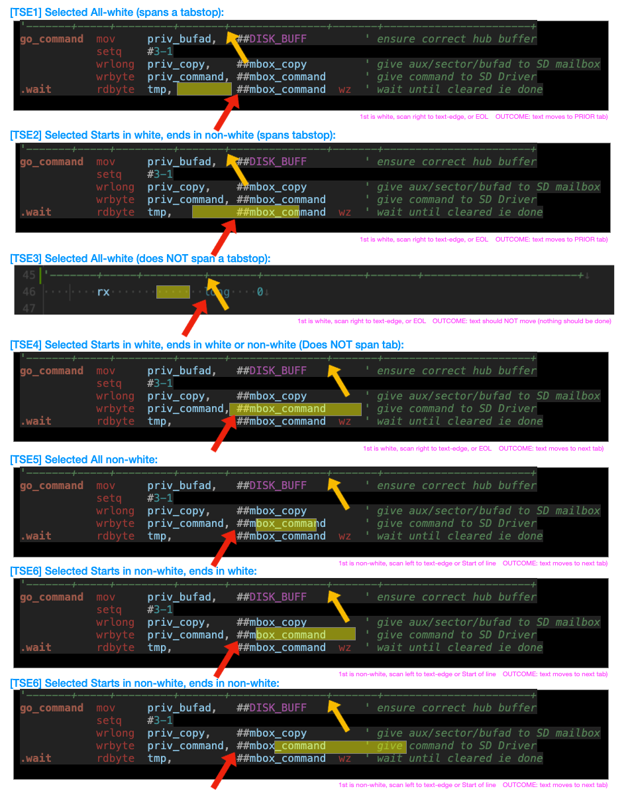

# Spin2/Pasm2 Syntax highlighting and Code Navigation for VSCode

This page presents how we are thinking about the new Elastic Tabbing à la Propeller Tool as implemeted in our Spin2 extension for VSCode.

![Project Maintenance][maintenance-shield]

[![License][license-shield]](LICENSE)

## Spin2 Elastic Tabs - Visual Examples

The following examples show selection cases when about to press the TAB key.  These are the more difficult cases to explain in narrative so we include these marked up screen shots to make this more clear.

**NOTEs:** Within each example in the above image, the RED arrow points to the left-edge of text, the YELLOW arrow points to the tabstop while the semi-transparent YELLOW rectangle show the are selected in each case.

---

>  If you like my work and/or this has helped you in some way then feel free to help me out for a couple of :coffee:'s or :pizza: slices or support my work by contributing at Patreon!
>
>  &nbsp;&nbsp; -OR- &nbsp;&nbsp; [Patreon.com/IronSheep](https://www.patreon.com/IronSheep?fan_landing=true)

---

## License

Copyright © 2023 Iron Sheep Productions, LLC.

Licensed under the MIT License.

Follow these links for more information:

### [Copyright](copyright) | [License](LICENSE)

[maintenance-shield]: https://img.shields.io/badge/maintainer-stephen%40ironsheep%2ebiz-blue.svg?style=for-the-badge

[marketplace-version]: https://vsmarketplacebadge.apphb.com/version-short/ironsheepproductionsllc.spin2.svg

[marketplace-installs]: https://vsmarketplacebadge.apphb.com/installs-short/ironsheepproductionsllc.spin2.svg

[marketplace-rating]: https://vsmarketplacebadge.apphb.com/rating-short/ironsheepproductionsllc.spin2.svg

[license-shield]: https://camo.githubusercontent.com/bc04f96d911ea5f6e3b00e44fc0731ea74c8e1e9/68747470733a2f2f696d672e736869656c64732e696f2f6769746875622f6c6963656e73652f69616e74726963682f746578742d646976696465722d726f772e7376673f7374796c653d666f722d7468652d6261646765
